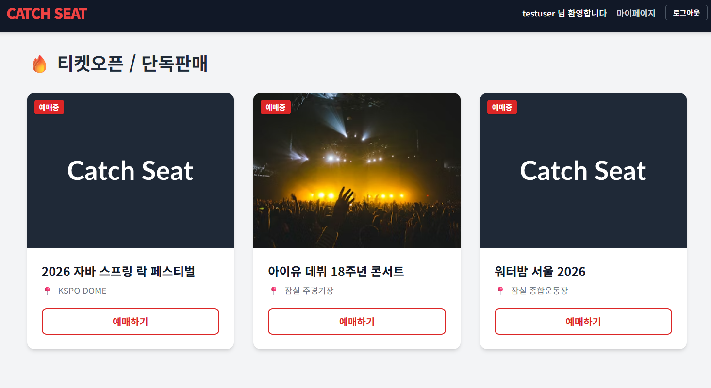

# 🎟️ 대규모 트래픽 대응 티켓팅 예매 플랫폼 [CATCH SEAT (캐치시트)]



## 프로젝트 개요

대형 콘서트나 뮤지컬 예매처럼 짧은 시간에 트래픽이 폭발적으로 몰리는 '선착순 좌석 예매' 상황을 다루는 플랫폼입니다.

단순히 재고를 차감하는 수준을 넘어, [회원 → 콘서트 → 좌석 → 예매]로 이어지는 도메인 흐름 안에서 데이터 정합성을 지키면서도 높은 동시 처리 성능을 내는 것을 목표로 했습니다. 특히 "같은 좌석에 수천 명이 동시에 몰릴 때 어떻게 정확히 한 명에게만 예매를 확정시킬 것인가"가 이 프로젝트의 핵심 질문이었습니다.

실제 티켓팅 서비스에 가깝도록 흐름을 [**입장 대기열 → 좌석 선점 → 결제 → 예매 확정**]으로 확장했고, 각 단계에서 트래픽을 통제하고 정합성을 보증하도록 설계했습니다.

### 설계의 출발점

핵심 예매 로직은 이전에 진행한 **Redis 비동기 대기열 아키텍처 실험**을 기반으로 발전시켰습니다. 그 실험에서 가상 사용자 3,000명이 1초 안에 동시 접속하는 환경을 견딜 수 있는지 검증했고, 평균 응답 267ms · 처리량 1,550 TPS · 에러율 0%라는 결과를 확인했습니다. ([이전 쿠폰 시스템 최적화 과정](https://github.com/Kanghs0212/coupon/blob/master/Redis_README.MD))

캐치시트는 여기서 한 걸음 더 나아가, 락 점유로 생기는 동기식 DB 커넥션 병목을 없애기 위해 좌석 선택 요청을 Redis 메모리 계층에서 먼저 선점한 뒤, 백그라운드 Worker가 DB 갱신과 예매 발행을 처리하는 구조로 확장했습니다.

---

## 1. 기술 스택

* **Language:** Java 17
* **Framework:** Spring Boot 3.5.14, Spring Security, Bean Validation
* **Build:** Gradle
* **Database:** PostgreSQL 15 (운영 및 부하 테스트), Redis (입장 대기열 / 좌석 선점 / 토큰 관리)
* **ORM:** Spring Data JPA, Hibernate
* **Auth:** JWT
* **Test:** JUnit 5, Apache JMeter
* **Infra:** Docker & Docker Compose
* **Frontend:** React (SPA)

---

## 2. 데이터베이스 모델링

비즈니스 요구사항에 맞춰 데이터 중복을 줄이고 연관 관계를 명확히 정의했습니다.


* **Member : Reservation (1:N)** — 한 회원은 여러 번 예매할 수 있지만, 각 예매 내역은 한 회원에게만 속합니다.
* **Concert : Seat (1:N)** — 하나의 콘서트는 여러 좌석을 가집니다.
* **Seat : Reservation (1:1)** — 특정 콘서트의 특정 좌석은 하나의 예매 내역과만 매핑됩니다. 이 제약이 중복 예매를 막는 마지막 방어선 역할을 합니다.

좌석과 예매는 결제 흐름을 표현하기 위해 상태를 가집니다.

* **Seat.status** — `AVAILABLE`(예매 가능) → `HELD`(선점, 결제 대기) → `RESERVED`(예매 확정)
* **Reservation.status** — `PENDING`(결제 대기) → `CONFIRMED`(결제 완료), 그리고 결제 마감 시각(`expiresAt`)을 함께 저장합니다.

---

## 3. 정규화 분석

이상 현상(Anomaly)을 막기 위해 테이블 구조를 제3정규형(3NF)까지 정리했습니다.

**1NF** — 모든 속성이 더 이상 쪼갤 수 없는 원자 값을 가집니다. 회원 이름, 좌석명, 예매 일시 모두 단일 값이라 1NF를 만족합니다.

**2NF** — 모든 테이블이 복합키 대신 단일 대리키(`id`)를 기본키로 사용합니다. 기본키가 단일 컬럼이라 부분 함수 종속이 발생할 수 없어 2NF를 만족합니다.

**3NF** — 일반 속성 간 이행적 종속이 없습니다. 예를 들어 Seat 테이블에서 `price`는 좌석명(`seat_name`)이 아니라 오직 기본키 `id`에 의해서만 결정됩니다(같은 좌석명이라도 공연마다 가격이 다를 수 있기 때문). 모든 비기본 속성이 기본키에만 직접 종속되므로 3NF를 만족합니다.

---

## 4. 핵심 아키텍처: 입장 대기열 → 선점 → 결제 → 확정

같은 좌석(예: A열 1번)에 수천 명이 동시에 몰리는 상황을 가정하고, 트래픽을 단계적으로 걸러내면서 정확히 한 명만 예매에 성공하도록 설계했습니다.

```
[입장 대기열] → [좌석 선점(HELD)] → [결제] → [예매 확정(RESERVED)]
                        │                          └ 미결제 시 스케줄러가 자동 해제
                        └ Redis SETNX로 원자적 선점, 통과분만 비동기 Worker가 처리
```

### 4.1 실시간 입장 대기열

좌석 페이지에 진입하기 전에 사용자를 가상의 대기열에 세웁니다. Redis **Sorted Set**에 도착 순서(score)로 줄을 세우고, `ZRANK`로 대기 순번을 계산해 프론트에 실시간으로 보여줍니다. 백그라운드 스케줄러가 일정 주기마다 앞에서부터 정해진 인원만 `ZPOPMIN`으로 입장시켜 통과자 집합(Set)에 넣고, **대기열을 통과한 사용자만** 좌석 선점 요청을 보낼 수 있습니다. 애초에 좌석/DB 계층에 도달하는 트래픽 자체를 앞단에서 통제하는 1차 방어입니다.

### 4.2 좌석 선점 (Redis SETNX) + 비동기 Worker

사용자가 좌석을 누르면 DB 트랜잭션을 열지 않고 Redis의 `setIfAbsent`(원자적 연산)로 좌석 소유권을 먼저 확정합니다. 선점에 성공한 요청만 Redis 큐에 적재하고 나머지에는 즉시 선점 실패를 돌려줘, 대부분의 요청이 WAS·DB까지 도달하기 전에 걸러집니다. 큐에 쌓인 요청은 백그라운드 Worker가 꺼내어 좌석을 `HELD`로 바꾸고 예매(`PENDING`)를 생성합니다.

### 4.3 결제와 좌석 홀드 타임아웃

선점은 곧바로 예매 확정이 아니라 **결제 대기(HELD)** 상태로 좌석을 일정 시간 잡아 둡니다.

* 제한 시간 안에 결제하면 좌석은 `RESERVED`, 예매는 `CONFIRMED`로 확정됩니다.
* 시간 내에 결제하지 않으면 스케줄러가 좌석을 다시 `AVAILABLE`로 되돌리고 미결제 예매를 정리합니다.
* 사용자는 마이페이지의 '결제 대기' 목록에서 남은 시간 카운트다운을 보며 시간 내에 이어서 결제할 수 있습니다.

### 4.4 정합성 3중 방어

같은 좌석에 대한 중복 확정을 서로 다른 계층에서 겹겹이 막습니다.

1. **입장 대기열** — 좌석 페이지에 진입하는 인원 자체를 통제
2. **Redis SETNX 선점** — 같은 좌석 동시 클릭 시 원자적으로 단 한 명만 통과
3. **DB 제약** — 좌석 상태 가드와 `@OneToOne` 유니크 제약(SQLState 23505)으로 최종 보증

### 4.5 큐 신뢰성

메시지가 유실되지 않도록 처리 과정을 보강했습니다.

* Worker는 요청을 곧바로 꺼내지 않고 `LMOVE`로 **처리중 리스트**로 옮긴 뒤, DB 커밋이 끝나야 제거(ack)합니다. 처리 도중 장애가 나도 메시지가 남고, 앱 재시작 시 처리중 리스트를 큐로 되돌려 복구합니다.
* 처리에 실패한 요청은 **DLQ(Dead Letter Queue)** 에 적재하고 좌석 락을 해제합니다.
* Worker는 한 주기에 큐를 비우도록 반복 처리해 처리량을 확보합니다.

### 4.6 부하 테스트 결과 (JMeter)

Redis 선점 + DB 유니크 방어의 정합성과 성능을 부하 테스트로 검증했습니다.

* **시나리오:** 단일 좌석에 1초간 3,000명이 동시 예매 요청
* **동시성 제어:** 정확히 1건만 성공, 나머지 2,999건은 의도대로 선점 실패 응답 처리
* **데이터 무결성:** `reservation` 테이블에 데이터가 정확히 1건만 적재됨
* **성능:** 동기식 락 방식 대비 큰 폭으로 향상된 1,550 TPS 달성 (Tomcat 인프라 튜닝 병행)

> 2,999건의 실패는 오류가 아니라 "한 좌석은 한 명에게만"이라는 비즈니스 규칙에 따른 의도된 결과입니다. 이 정합성은 자동화된 동시성 테스트로도 검증했습니다(아래 6번).

---

## 5. 보안 및 서비스 통합

실제 서비스와 비슷한 사용자 경험과 보안을 갖추기 위해 Spring Security와 프론트엔드를 연동했습니다.

### Spring Security + JWT

회원가입 시 비밀번호는 BCrypt로 암호화해 저장하고, 로그인하면 JWT를 발급합니다. 요청이 들어오면 `JwtAuthenticationFilter`가 토큰의 위변조·만료를 검사하고, 토큰에 담긴 `memberId`를 꺼내 인증 정보에 실어 둡니다.

* **파라미터 조작 방지** — 예매·마이페이지에서 회원 식별자를 클라이언트 파라미터가 아니라 검증된 토큰에서 꺼내므로, 남의 ID를 사칭할 수 없습니다.
* **접근 제어** — 콘서트/좌석 조회(GET)만 공개하고, 예매·결제·마이페이지는 인증을 요구합니다. 예매 요청은 대기열을 통과한 회원인지까지 확인합니다.
* **입력 검증 / 에러 처리** — 회원가입·로그인 입력은 Bean Validation으로 검증하고, 로그인 실패 메시지는 계정 존재 여부가 드러나지 않도록 통일했습니다.
* **설정 외부화** — JWT 서명 키와 DB 접속 정보는 환경변수로 주입할 수 있게 분리했습니다.
* **토큰 만료 처리** — 프론트엔드는 토큰 만료 시각을 검사해 만료되면 자동 로그아웃 처리합니다.

### 마이페이지 & React 연동

`ReservationController`로 결제 완료 내역 조회·결제 대기 내역 조회·결제 처리 API를 만들고, React 기반 SPA 클라이언트를 붙여 [회원가입 → 로그인 → 입장 대기열 → 좌석 선점 → 결제 → 마이페이지 확인]으로 이어지는 전체 흐름을 완성했습니다.

---

## 6. 테스트 및 운영 편의

* **동시성 테스트** — 같은 좌석에 다수 스레드가 동시에 선점을 시도해도 정확히 1건만 성공함을 자동화 테스트로 검증했습니다.
* **인증 테스트** — JWT 발급·검증·클레임 추출과 위·변조 토큰 거부를 단위 테스트로 검증했습니다.
* **초기 데이터 시더** — 앱 실행 시 콘서트·좌석 데모 데이터를 자동으로 시딩합니다(회원 데이터는 보존).
* **설정 외부화** — 선착순 한도, 좌석 선점/결제 대기 시간, 대기열 입장 속도, Worker 주기 등을 `application.yml`에서 조정할 수 있습니다.

---

## 7. 회고

이 프로젝트에서 가장 값졌던 부분은 "동작하는 API"를 넘어 트래픽이 몰릴 때 [OS 소켓 → Tomcat 스레드 → Redis → DB 커넥션]으로 이어지는 각 레이어의 병목을 직접 눈으로 확인하고 튜닝해 본 경험입니다.

처음에는 분산 락만으로 동시성을 제어하려 했지만, 락을 얻은 스레드들이 한정된 DB 커넥션 풀을 두고 다시 경쟁하면서 오히려 처리량이 폭락하는 문제를 만났습니다. JMeter 부하 테스트로 병목 지점을 데이터로 확인한 뒤 비동기 이벤트 큐 구조로 개편했고, 여기에 입장 대기열·결제/홀드 타임아웃·JWT 보안·React 연동까지 더해 실제 티켓팅 서비스에 가까운 형태로 완성했습니다. 성능 개선을 감이 아니라 측정 근거로 판단하고, 정합성은 여러 계층에서 겹겹이 보증하도록 설계하는 습관을 들인 것이 가장 큰 수확이었습니다.
